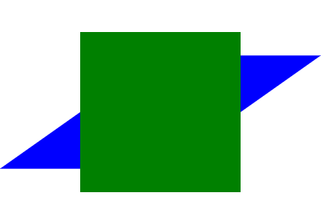
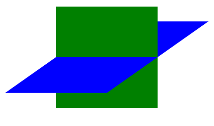

# 3D转换

## 目标

- 掌握使用CSS完成一些3d效果
- 理解在网页平面内的3d效果

## 怎么在网页平面产生3d效果 

- 我们生活的环境是3d的，照片就是3d物体在2d平面呈现的例子
- 有什么特点：
  + 近大远小
  + 物体后面遮挡不可见
- 当我们在网页上构建3d效果的时候参考这些特点就能产出3d效果
- 在现实生活当中 我们通过肉眼去物体的时候和照片的成像是相同的
- 如果想要在网页产生3d效果需要透视（理解成3d物体投影在2d平面内）

## 透视和视距


- 透视（perspective）
    + 在2d平面产生近大远小视觉立体，但是只是效果二维的
    + 原理：  
      </img>   
      a. 模拟人类的视觉位置，可认为安排一只眼睛去看  
      b. 距离电脑平面的距离为视距  
      c. 距离视觉点越近的在电脑平面成像越大，越远成像越远  
    + 特点：只是显示3d图像的近大远小效果，无法呈现3d的三维成像的特点，如遮挡
    + 使用场景：只是辅助性的帮助开发者检查3d效果

    ​


## 3d转换

- `translateX`  x轴方向的位移
- `translateY`  y轴方向的位移
- `translateZ ` z轴方向的位移
- `rotateX` 绕x轴旋转
- `rotateY` 绕y轴旋转
- `rotateZ` 绕z轴旋转 

## 3d呈现

+ 3d呈现（transfrom-style）
  + 在2d平面产生近大远小视觉立体，但是只是效果二维的
  + 原理：  
    </img> </img>   
    a. 第一张图是没有使用3d呈现的  无3d效果
    b. 第二张图是使用了3d呈现的  出现遮挡三维立体效果
  + 特点：真正意义的3d呈现，三维立体,有遮挡
  + 使用场景：在3d立体图形的构建使用

## 综合案例

```html
<!DOCTYPE html>
<html lang="en">
<head>
    <meta charset="UTF-8">
    <title>Title</title>
    <style>
        .box{
            width: 200px;
            height: 200px;
            position: relative;
            margin: 100px auto;
            /*辅助3d效果开发  视觉效果 */
            /*透视：理解成在屏幕外面安排一只眼睛帮我们开3d效果*/
            /* 形成近大远小 效果  */
            /*perspective: 300px;*/

            /*真正意义的3D呈现 */
            transform-style: preserve-3d;

            transform: rotateX(30deg) rotateY(-30deg);

            animation: rotate 4s linear infinite;

        }
        .box > div{
            width: 100%;
            height: 100%;
            position: absolute;
            left: 0;
            top: 0;
            text-align: center;
            line-height: 200px;
            font-size: 20px;
            opacity: 0.4;
        }
        .box .front{
            background: red;
            transform: translateZ(100px);
        }
        .box .back{
            background: blue;
            transform: rotateY(-180deg) translateZ(100px);
        }
        .box .left{
            background: green;
            transform: rotateY(-90deg) translateZ(100px);
        }
        .box .right{
            background: yellow;
            transform: rotateY(-270deg) translateZ(100px);
        }
        .box .top{
            background: pink;
            transform: rotateX(90deg) translateZ(100px);
        }
        .box .bottom{
            background: hotpink;
            transform: rotateX(-90deg) translateZ(100px);
        }
        /* 立方体的中心在电脑平面上  */
        /* 当你选择过后正面朝外 Z正方向也是朝外 */

        @keyframes rotate {
            from{

            }
            to{
                transform: rotateX(30deg) rotateY(-390deg);
            }
        }
    </style>
</head>
<body>
    <div class="box">
        <div class="front">front</div>
        <div class="back">back</div>
        <div class="left">left</div>
        <div class="right">right</div>
        <div class="top">top</div>
        <div class="bottom">bottom</div>
    </div>
</body>
</html>
```


## 总结

- 怎么在2d的网页体现3d效果
  - 拍照片  物体 呈现 近大远小
  - 在网页 也可以安排一只虚拟的眼睛  帮我们去观察 立体的物体
- 透视
  - perspective:100px;
  - 视距  距离越近 近大远小的效果 越明显
  - 作用：辅助观察3d效果，不能真正的呈现3d
- 3d转换
  - rotateX
  - rotateY
  - rotateZ
  - translateX
  - translateY
  - translateZ