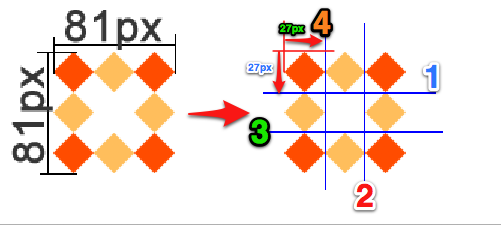
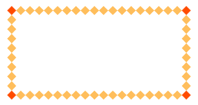
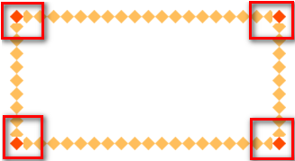
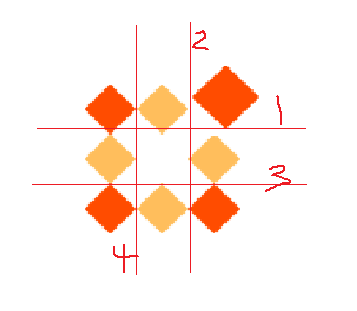
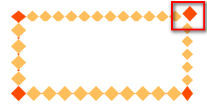

# 边框图片

## 目标

- 扩展知识增加一下知识面

### 原理

border-image

设置的图片将会被“切割”成九宫格形式，然后进行设置。如下图

“切割”完成后生成虚拟的9块图形，然后按对应位置设置背景，

其中四个角位置、形状保持不变，中心位置水平垂直两个方向平铺。如下图

 

**1、round和repeat之间的区别******

round 会自动调整尺寸，完整显示边框图片。

 

repeat 单纯平铺多余部分，会被“裁切”而不能完整显示。

 

**2、更改裁切尺寸******

border-image-slice: 34 36 27 27 分别设置裁切如下图

 

 

## 属性

- `border-image-source`  图片地址
- `border-image-slice` 图片裁剪尺寸
- `border-image-width` 边框的宽度
- `border-image-repeat` 平铺方式  `stretch` `round` `repeat`

## 总结

 关于边框图片重点理解9宫格的裁切及平铺方式，实际开发中应用不广泛，但是如能灵活动用会给我们带来不少便利。